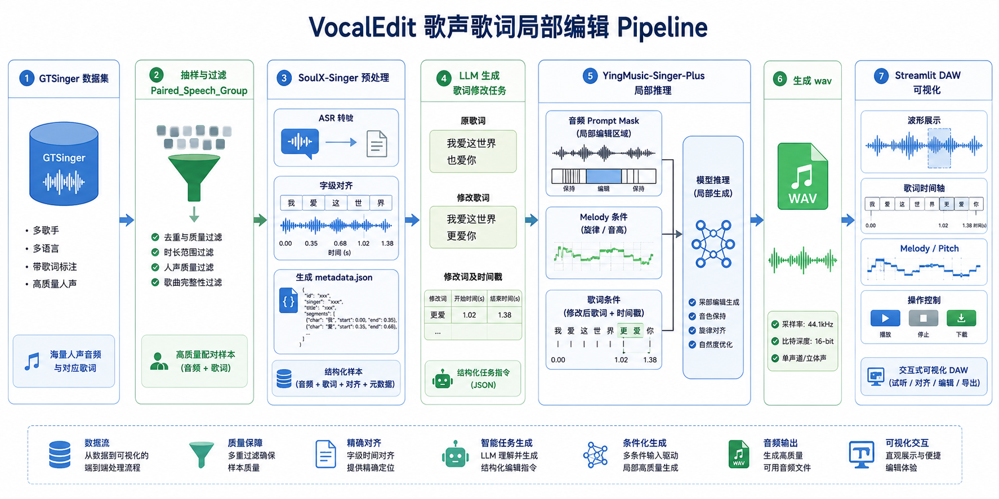
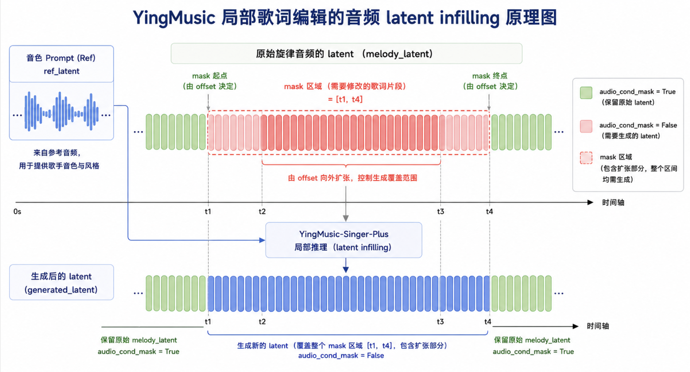

# VocalEdit Pipeline 技术报告

## 摘要

VocalEdit 当前实现了一条面向歌声局部歌词编辑的实验 pipeline。系统使用 SoulX-Singer 完成音频预处理、ASR 转写和字级时间对齐，使用 LLM 生成歌词替换任务，再调用修改后的 YingMusic-Singer-Plus 推理脚本进行局部重合成。最终结果通过 Streamlit 应用以类 DAW 形式查看原音频、编辑音频、歌词变更和时间范围。

当前主线只处理中文歌声。英文数据暂不进入后续流程。

## 目标

本 pipeline 的目标不是完整训练新模型，而是在已有开源模型基础上完成可复现的推理型歌词编辑流程：

1. 从大规模数据集里抽取可控小样本。
2. 自动获得 ASR 歌词和歌词时间戳。
3. 自动生成“原歌词 -> 修改歌词”的任务。
4. 在保持未编辑区域音频 latent 不变的前提下，只生成被修改歌词对应的局部区域。
5. 提供可视化工具快速听辨和检查结果。

## 系统组成

项目由三部分组成：

```text
VocalEdit/
  SoulX-Singer/              # 上游预处理项目，负责 ASR、对齐、F0、切片等
  YingMusic-Singer-Plus/     # 上游推理模型，已修改局部编辑推理逻辑
  pipeline/                  # 本项目的编排层、CLI、文档、可视化
```

`pipeline/` 是本项目新增的工作流层，负责数据抽样、批量调用、任务 manifest、LLM 任务生成、推理批处理和结果查看。

## 总体流程

完整流程如下：

```text
GTSinger 数据集
    |
    | 1. 抽样，过滤 Paired_Speech_Group 朗读音频
    v
小型中文 wav 数据集
    |
    | 2. SoulX-Singer 批量预处理
    v
ASR 歌词 + SoulX metadata.json 字级时间戳
    |
    | 3. 解析 note_type，合并重复/延长字，调用 DeepSeek 生成歌词修改任务
    v
lyric edit task manifest
    |
    | 4. 修改后的 YingMusic-Singer-Plus 局部推理
    v
编辑后 wav + inference_results.jsonl
    |
    | 5. Streamlit DAW 可视化检查
    v
人工听辨、对比、筛选
```

建议为这部分画一张架构图。

**图 1 建议：Pipeline 总览架构图**



## 数据阶段

### GTSinger 抽样

关键文件：

[pipeline/scripts/create_gtsinger_mini_dataset.py](scripts/create_gtsinger_mini_dataset.py)

该脚本从 GTSinger 的 `Chinese` 和 `English` 目录中随机抽取 wav，并复制到独立小数据集目录。后续主线只使用中文目录。

重要逻辑：

- 使用固定随机种子，保证抽样可复现。
- 输出 `manifest.jsonl` 和 `summary.json`。
- 过滤 `.ipynb_checkpoints`。
- 过滤任何路径中包含 `Paired_Speech_Group` 的 wav，因为该目录保存朗读音频，不是歌声音频。

核心过滤逻辑：

```python
EXCLUDED_DIR_NAMES = {".ipynb_checkpoints", "Paired_Speech_Group"}


def find_wavs(language_root: Path) -> list[Path]:
    return sorted(
        path
        for path in language_root.rglob("*.wav")
        if path.is_file() and EXCLUDED_DIR_NAMES.isdisjoint(path.parts)
    )
```

### 通用音频扫描

关键文件：

[pipeline/scripts/discover_audio.py](scripts/discover_audio.py)

这是一个通用扫描脚本，用于非 GTSinger 数据集。它递归查找音频文件并输出 JSONL manifest。当前 GTSinger 小样本流程主要使用 `create_gtsinger_mini_dataset.py`。

## SoulX-Singer 预处理阶段

关键文件：

[pipeline/scripts/run_soulx_alignment_batch.py](scripts/run_soulx_alignment_batch.py)

该脚本批量调用 SoulX-Singer 的 `preprocess.pipeline`：

```bash
conda run -n align python -m preprocess.pipeline \
  --audio_path <wav> \
  --save_dir <item_output> \
  --language Mandarin \
  --device cuda \
  --vocal_sep False \
  --max_merge_duration 30000 \
  --midi_transcribe True
```

每条音频生成独立输出目录：

```text
pipeline/runs/soulx_align_gtsinger_mini_40_chinese/items/<id>/
  metadata.json
  vocal.wav
  vocal_f0.npy
  cut_wavs/
  long_cut_wavs/
```

批处理结果写入：

```text
pipeline/runs/soulx_align_gtsinger_mini_40_chinese/alignment_results.jsonl
```

### SoulX metadata 的 note_type 处理

SoulX 的 `metadata.json` 里，歌词 token 与时长由 `text`、`duration`、`note_type` 等字段共同描述。本 pipeline 处理三类 `note_type`：

| note_type | 含义 | 处理方式 |
| --- | --- | --- |
| `1` | 静音/空白，如 `<SP>` | 忽略，不进入歌词 |
| `2` | 正常歌词字 | 作为一个新中文字加入歌词序列 |
| `3` | 前一个字的延长或重复发声 | 不新增字，只把持续时间合并到前一个字 |

这个设计避免了歌词中出现重复字，同时保留正确的时间跨度。

## 歌词修改任务生成阶段

关键文件：

[pipeline/scripts/create_lyric_edit_tasks.py](scripts/create_lyric_edit_tasks.py)

该脚本读取 SoulX 对齐 manifest，解析每条 `metadata.json`，生成一条歌词修改任务。

任务包含：

```json
{
  "id": "chinese_001_fb61ea373d",
  "audio_path": ".../chinese_001_fb61ea373d.wav",
  "metadata_path": ".../metadata.json",
  "original_lyrics": "朦胧的世界我们留了多远",
  "edited_lyrics": "明亮的世界我们留了多远",
  "original_word": "朦胧",
  "replacement_word": "明亮",
  "char_start": 0,
  "char_end": 2,
  "edit_start_sec": 0.15,
  "edit_end_sec": 1.23,
  "status": "success"
}
```

### LLM 任务约束

DeepSeek 负责选择一个可修改词并给出替换词。脚本会验证 LLM 输出，确保：

- 原词确实出现在原歌词的指定位置。
- 替换词与原词字数相同。
- 替换后歌词总长度不变。
- 每个对应中文字的无声调拼音不同。
- 修改片段时间戳来自 SoulX 字级对齐结果。
- 失败时写入 failed JSONL，便于重试或人工检查。

DeepSeek API key 存放在 `pipeline/.env`：

```bash
deepseek_api_key=...
```

## YingMusic-Singer-Plus 推理改动

这一部分是系统的核心修改。

关键文件：

- [YingMusic-Singer-Plus/src/YingMusicSinger/infer/YingMusicSinger.py](../YingMusic-Singer-Plus/src/YingMusicSinger/infer/YingMusicSinger.py)
- [YingMusic-Singer-Plus/src/YingMusicSinger/models/model.py](../YingMusic-Singer-Plus/src/YingMusicSinger/models/model.py)
- [pipeline/scripts/run_yingmusic_lyric_edit_tasks.py](scripts/run_yingmusic_lyric_edit_tasks.py)

根仓库中也保存了对应 patch：

```text
patches/0001-Add-lyric-edit-audio-infilling-controls.patch
```

### 原始 prompt 理解

YingMusic-Singer-Plus 的推理输入可以理解为三类条件：

1. 音频 prompt：前半段提供音色参考，后半段对应 melody prompt 音频。
2. melody/MIDI 或隐藏层旋律条件：提供目标旋律信息。
3. 歌词条件：使用句级对齐，把参考歌词和目标歌词拼接到条件序列中。

原始编辑模式更接近“给定参考音频和目标旋律/歌词，生成目标音频”。本项目把它改造成“局部完形填空式编辑”。

### 本项目的局部音频 infilling 逻辑

当前逻辑如下：

1. 不强制指定额外音色参考。
2. 如果 `ref_audio_path is None`，直接复用 `melody_audio_path` 作为音色来源。
3. 编码参考音频得到 `ref_latent`。
4. 编码原始 melody 音频得到 `melody_latent`。
5. 拼接得到完整音频条件：

```python
full_audio_latent = torch.cat([ref_latent, melody_latent], dim=1)
```

6. 构造 `audio_cond_mask`：

- `True`：保留原始 latent 作为条件。
- `False`：mask 掉，由模型生成。

7. 被修改词对应的 target 时间范围设为 `False`。
8. 采样后，再用同一个 `audio_cond_mask` 做 latent 回填：

```python
generated_latent[:, :replace_len, :] = torch.where(
    replace_mask,
    source_latent,
    generated_latent[:, :replace_len, :],
)
```

最终效果：

- mask 区间内保留模型生成结果。
- mask 区间外替换回原始 melody/timbre latent。

### mask offset 机制

为避免边界处编辑不自然，pipeline 支持只扩大 mask 区域：

```bash
--mask-start-offset-sec 0.2
--mask-end-offset-sec 0.3
```

实际 mask 时间窗为：

```python
mask_start_sec = max(0.0, edit_start_sec - edit_mask_start_offset_sec)
mask_end_sec = edit_end_sec + edit_mask_end_offset_sec
```

例如原始编辑词时间为 `0.15s - 1.23s`，传入 `0.2/0.3` 后，实际生成区域变成 `0.0s - 1.53s`。

注意：offset 只会增加 mask 区域，不会减少原本的编辑区域。

### melody/MIDI 条件保持不变

本项目只修改音频 prompt 的 mask 和 latent 回填逻辑。melody/MIDI 条件和歌词条件仍沿用 YingMusic-Singer-Plus 的原始流程。

模型采样接口新增了两个 mask：

```python
audio_cond_mask=None
midi_prompt_mask=None
```

这样音频条件和 melody 条件可以解耦：

- `audio_cond_mask` 控制哪些音频 latent 作为条件、哪些由模型生成。
- `midi_prompt_mask` 控制 melody 条件中哪些位置视为 prompt 区域。


**局部 latent infilling 原理图**



## 批量推理阶段

关键文件：

[pipeline/scripts/run_yingmusic_lyric_edit_tasks.py](scripts/run_yingmusic_lyric_edit_tasks.py)

该脚本读取歌词编辑任务，逐条调用修改后的 `YingMusicSinger.forward()`。

常用命令：

```bash
HF_ENDPOINT=https://hf-mirror.com python pipeline/scripts/run_yingmusic_lyric_edit_tasks.py \
  --task-manifest pipeline/manifests/02_lyric_edit_tasks.gtsinger_mini_40_chinese.jsonl \
  --yingmusic-root YingMusic-Singer-Plus \
  --output-dir pipeline/runs/yingmusic_lyric_edit_gtsinger_mini_40_chinese_hardmask \
  --conda-env ymsp \
  --ckpt-path ASLP-lab/YingMusic-Singer-Plus \
  --device cuda:0 \
  --mask-start-offset-sec 0.2 \
  --mask-end-offset-sec 0.3 \
  --overwrite
```

输出：

```text
pipeline/runs/<run_name>/
  inference_results.jsonl
  wavs/<task_id>.wav
  logs/<task_id>.log
```

`inference_results.jsonl` 会记录：

- 原音频路径。
- 生成音频路径。
- 原歌词和修改歌词。
- 原词和替换词。
- 原始编辑时间 `edit_start_sec/edit_end_sec`。
- 实际 mask 时间 `mask_start_sec/mask_end_sec`。
- offset 参数。
- 推理状态。

## Streamlit 可视化阶段

关键文件：

[pipeline/scripts/view_lyric_edit_tasks.py](scripts/view_lyric_edit_tasks.py)

该应用读取 task manifest 和 inference result manifest，逐条展示编辑任务。

主要功能：

- 显示原歌词、修改歌词，并高亮修改词。
- 显示修改词、替换词、起止时间。
- 类 DAW 双音轨视图：Original / Edited。
- 红色竖线播放头穿过两条波形。
- 空格键播放/暂停。
- 点击或拖动波形区域移动播放头。
- 点击音轨或按钮选择当前播放音轨。
- 每次只播放选中的一条音轨。

启动方式：

```bash
conda run -n ymsp streamlit run pipeline/scripts/view_lyric_edit_tasks.py \
  --server.headless true \
  --server.address 0.0.0.0 \
  --server.port 8501
```

建议为这部分画一张 UI 示意图。

**图 3 建议：Streamlit DAW 可视化界面示意图**


## 关键文件索引

| 文件 | 作用 |
| --- | --- |
| `pipeline/scripts/create_gtsinger_mini_dataset.py` | 从 GTSinger 抽样，过滤朗读音频目录 |
| `pipeline/scripts/discover_audio.py` | 通用音频递归扫描 |
| `pipeline/scripts/run_soulx_alignment_batch.py` | 批量调用 SoulX 预处理和对齐 |
| `pipeline/scripts/create_lyric_edit_tasks.py` | 解析 SoulX metadata，调用 LLM 生成歌词修改任务 |
| `pipeline/scripts/run_yingmusic_lyric_edit_tasks.py` | 批量调用 YingMusic 局部编辑推理 |
| `pipeline/scripts/view_lyric_edit_tasks.py` | Streamlit 可视化和听辨工具 |
| `YingMusic-Singer-Plus/src/YingMusicSinger/infer/YingMusicSinger.py` | 修改后的高层推理接口，构造音频 mask 和 latent 回填 |
| `YingMusic-Singer-Plus/src/YingMusicSinger/models/model.py` | 修改后的采样接口，支持独立 audio/midi mask |
| `SoulX-Singer/preprocess/tools/lyric_transcription.py` | SoulX 英文 ASR 兼容性补丁 |
| `patches/*.patch` | 上游项目改动的可移植 patch |
| `pipeline/README.md` | 用户操作文档 |

## 可复现性设计

本 pipeline 使用 manifest 驱动的设计：

```text
00_discovered / dataset manifest
01_aligned
02_lyric_edit_tasks
inference_results
```

每个阶段读取上一阶段 JSONL，写出新 JSONL，不直接修改上一阶段结果。这样做有几个好处：

- 方便中断后恢复。
- 每个阶段可以单独调试。
- 出错样本可以通过 failed manifest 复查。
- 推理参数可以写入结果 manifest，便于实验对比。

## 已验证状态

当前已经验证过：

- GTSinger 抽样会过滤 `Paired_Speech_Group`。
- SoulX 中文 20 条样本对齐成功。
- DeepSeek 生成 20 条歌词修改任务成功。
- YingMusic hard mask 推理 20 条成功。
- mask offset smoke test 成功。
- Streamlit 可视化服务可正常启动。
- Git 根仓库已忽略数据、运行结果、`.env` 和权重文件。

## 局限与后续工作

当前系统仍有一些实验性限制：

1. 只主线支持中文歌词编辑。
2. LLM 生成的替换词虽然做了规则校验，但语义自然度仍需人工检查。
3. SoulX 对齐质量会直接影响 mask 时间窗准确性。
4. 当前 latent 回填是硬边界，可能在某些样本产生边界听感突变。
5. melody/MIDI 条件没有随歌词语义变化重新估计，只保持原旋律条件。
6. Streamlit 可视化主要用于人工听辨，不做自动质量评估。

后续可以考虑：

- 引入自动边界平滑或短 crossfade 的可控选项。
- 增加批量主观评分字段和筛选导出功能。
- 支持更大规模中文样本批处理。
- 把 task manifest、结果 manifest 和音频文件组织成可发布的评测集格式。
- 增加 objective metrics，例如编辑区能量变化、未编辑区 waveform/latent 差异等。

## 总结

VocalEdit pipeline 将 SoulX-Singer 的预处理能力、LLM 的歌词任务生成能力和 YingMusic-Singer-Plus 的歌声生成能力串联起来，实现了一个可复现、可批量运行、可视化检查的局部歌词编辑工作流。

核心技术点是对 YingMusic-Singer-Plus 的音频 prompt 条件进行局部 mask，并在采样后用原始 latent 回填未编辑区域。这使模型主要负责重建歌词变化对应的局部片段，而尽量保持其它时间位置的音频不变。
